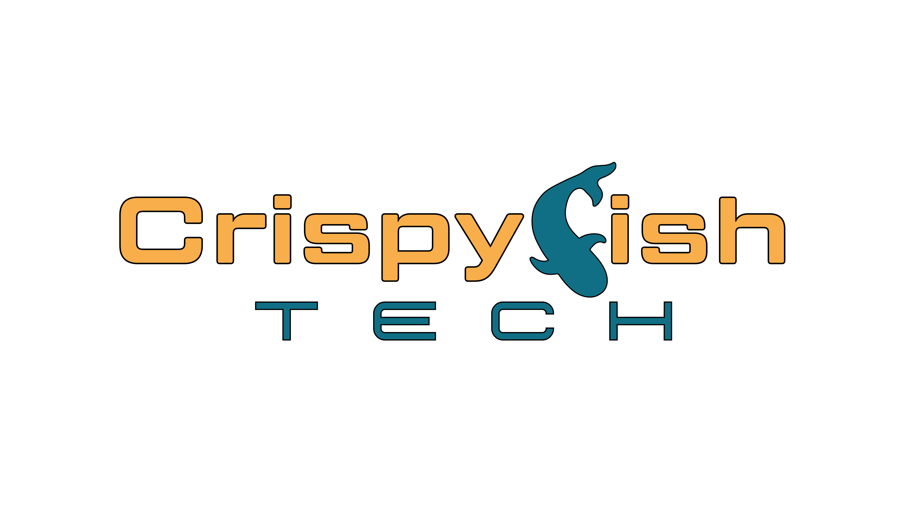

# Kubernetes Demo Application - Crispyfish Edition 🐟️

This is an updated version of a Go demo application used for demonstrating Kubernetes and load balancing.

It will create a colored icon for each replica within a ReplicaSet and indicate which one
most recently served a response. Replicas which haven't been heard from will begin to fade
out, until after a configurable number of seconds they will disappear. This is useful for
demonstrating scaling up/down.

## Build

`docker build -t crispyfish-demo .`

## Paths

By default the loaded page will reach back to `/demo` every `REFRESH_INTERVAL` and use the returned information to update the display. Other paths are:

- `/info` - returns some additional information about the replica serving the request
- `/load` - adds a 2s delay to the response from `/info` - use this for putting artificial load on the system and watching the replicas scale

## Ports

The container will listen for traffic on port 8080.

## Running

1. Edit `base/configs/source-vars.yaml` and set the following:
    - `MY_NAMESPACE`: the namespace into which the app will be deployed (default: `crispyfish-demo`). This will be created if it does not already exist.
    - `URL_HOST`: the hostname portion of the URL that the ingress will answer on (default: `localhost`)
2. Run `kubectl apply -k base` to deploy the application.
